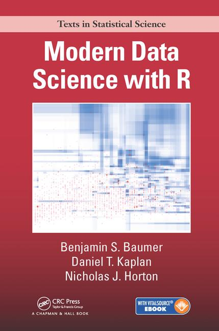
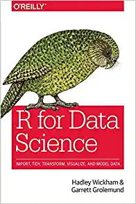

### Required Texts For Data Science I
 [Weill Cornell Medicine College](https://weill.cornell.edu/) 
 
_Baumer, Kaplan, Horton. Modern Data Science with R. CRC Press, 2017_
  

_VanderPlas, Jake. Python Data Science Handbook: Essential Tools for Working with Data: Wiley, 2017. [Free](https://jakevdp.github.io/PythonDataScienceHandbook/)_
  

_Wickham, Grolemund. R for Data Science. O’Reilly, 2017.[Free](http://r4ds.had.co.nz)_
  

_James, Gareth, et al. An introduction to statistical learning. Vol. 112. New York: springer, 2013. [Free](http://faculty.marshall.usc.edu/garethjames/ISL/)_
  

