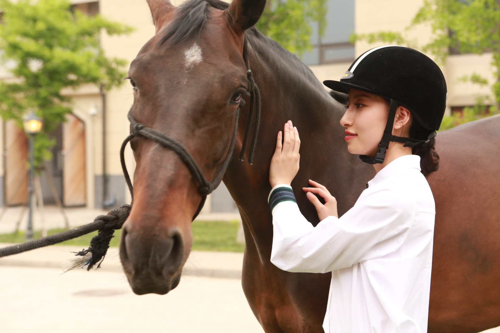

---
title = Fei Zhang
---

<link rel="stylesheet" href="academicons.css"/>
<link rel="stylesheet" href="styles.css" type="text/css">

# Fei Zhang
### MS of Biostatistics and Data Science
### Weill Cornell Medicine College

  

I obtained a bachelor's degree in statistics from [Central South University](http://www.csu.edu.cn/) in China. And I like to analyze data to answer research questions and test hypotheses. Currently I am a MS student at [Weill Cornell Medicine College](https://weill.cornell.edu/). 

My full resume is available [here](files/resume-Fei Zhang.pdf).
